# 🐍 Python KPS: Module 1

<div align="center">

<h3>โมดูลเรียนรู้ Python พื้นฐานด้วยตัวอย่างที่สนุกและเข้าใจง่าย</h3>

<p>
<b>สาขาวิชาวิศวกรรมคอมพิวเตอร์</b><br>
คณะวิศวกรรมศาสตร์และเทคโนโลยีอุตสาหกรรม
</p>

[](https://www.python.org/)
[](LICENSE)

</div>

---

## 📚 สารบัญ (Table of Contents)

| หมายเลข | หัวข้อ | ไฟล์ |
|---------|--------|------|
| 01 | คณิตศาสตร์เบื้องต้น | [01_basic_math.py](examples/01_basic_math.py) |
| 02 | คำสั่ง Print พื้นฐาน | [02_print_basic.py](examples/02_print_basic.py) |
| 03 | คำสั่ง Print พร้อมการคำนวณ | [03_print_calc.py](examples/03_print_calc.py) |
| 04 | ตัวแปร (Variables) | [04_variables.py](examples/04_variables.py) |
| 05 | คำสั่งเงื่อนไข (Conditionals) | [05_conditionals.py](examples/05_conditionals.py) |
| 06 | List (รายการ) | [06_lists.py](examples/06_lists.py) |
| 07 | ข้อมูลคะแนนเพื่อน | [07_friends_scores.py](examples/07_friends_scores.py) |
| 08 | วิเคราะห์คะแนนเพื่อน | [08_friends_analysis.py](examples/08_friends_analysis.py) |
| 09 | กราฟแท่งพื้นฐาน | [09_bar_chart.py](examples/09_bar_chart.py) |
| 10 | กราฟแท่งแบบปรับปรุง | [10_enhanced_bar_chart.py](examples/10_enhanced_bar_chart.py) |
| 11 | คำนวณพื้นที่สี่เหลี่ยมผืนผ้า | [11_area_rectangle.py](examples/11_area_rectangle.py) |
| 12 | คำนวณพื้นที่สามเหลี่ยม | [12_area_triangle.py](examples/12_area_triangle.py) |
| 13 | คำนวณพื้นที่วงกลม | [13_area_circle.py](examples/13_area_circle.py) |
| 14 | กราฟวงกลม | [14_area_circle_graph.py](examples/14_area_circle_graph.py) |
| 15 | กราฟเชิงเส้น | [15_linear_graph.py](examples/15_linear_graph.py) |
| 16 | วาดสี่เหลี่ยมด้วย Turtle | [16_turtle_square.py](examples/16_turtle_square.py) |
| 17 | วาดดาวด้วย Turtle | [17_turtle_star.py](examples/17_turtle_star.py) |
| 18 | วาดเกลียวด้วย Turtle | [18_turtle_spiral.py](examples/18_turtle_spiral.py) |
| 19 | วาดรูปทรงหลากหลายด้วย Turtle | [19_turtle_shapes.py](examples/19_turtle_shapes.py) |

---

## 🚀 วิธีการใช้งาน (Getting Started)

### การติดตั้ง Dependencies

```bash
pip install matplotlib ColabTurtle
```

### การรันไฟล์ตัวอย่าง

```bash
python examples/01_basic_math.py
```

---

## 📖 รายละเอียดแต่ละบทเรียน

---

### 01. คณิตศาสตร์เบื้องต้น (Basic Mathematics)

ตัวดำเนินการคณิตศาสตร์พื้นฐานใน Python:

| ตัวดำเนินการ | ความหมาย | ตัวอย่าง |
|--------------|----------|----------|
| `+` | บวก | `a + b` |
| `-` | ลบ | `a - b` |
| `*` | คูณ | `a * b` |
| `/` | หาร | `a / b` |
| `**` | ยกกำลัง | `a ** b` |
| `%` | หารเอาเศษ | `a % b` |

#### ตัวอย่างโค้ด:

```python
print(100+50)   # 150
print(100*50)   # 5000
print(100/50)   # 2.0
print(50**2)    # 2500
print(53**5)    # 418195493
```

#### ผลลัพธ์:

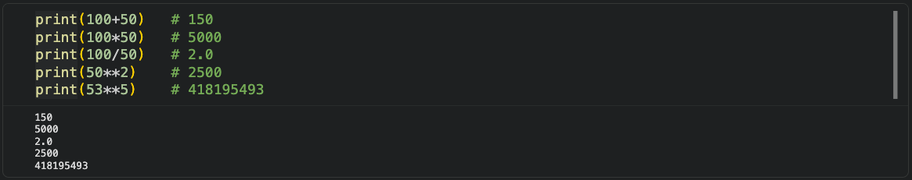

---

### 02. คำสั่ง Print พื้นฐาน (Basic Print Statements)

คำสั่ง `print()` ใช้สำหรับแสดงข้อมูลออกทางหน้าจอ

#### ตัวอย่างโค้ด:

```python
print("Hello World")
print("Student")
print(100)
print(50)
```

#### ผลลัพธ์:


---

### 03. คำสั่ง Print พร้อมการคำนวณ (Print with Calculation)

ตัวอย่างการแสดงข้อความร่วมกับการคำนวณ

#### ตัวอย่างโค้ด:

```python
print("ตัวเลข 100 บวกกับ 50 จะได้")
print("ผลลัพธ์คือ", 100+50)
```

#### ผลลัพธ์:

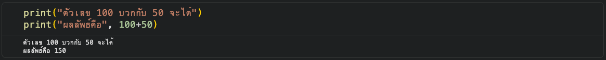

---

### 04. ตัวแปร (Variables)

ตัวแปรคือสิ่งที่ใช้เก็บข้อมูลของเรา การประกาศตัวแปรทำได้โดยกำหนดชื่อตัวแปรและค่าที่ต้องการเก็บ

#### ตัวอย่างโค้ด:

```python
my_name = "Thanakorn yarnguy"
number1 = 30
number2 = 25
print("ฉันชื่อ", my_name)
print("เลขตัวที่ 1 คือ", number1)
print("เลขตัวที่ 2 คือ", number2)

print("คนที่ 1 มีน้ำหนักเท่ากับ", number1, "คนที่ 2 มีน้ำหนักเท่ากับ", number2, "หน่วยเป็นกิโลกรัม")
```

#### ผลลัพธ์:

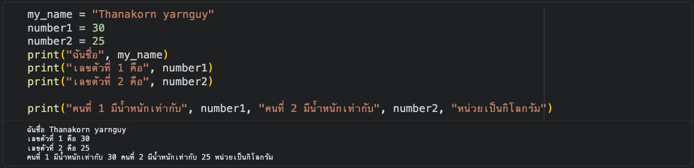

---

### 05. คำสั่งเงื่อนไข (Conditional Statements)

คำสั่ง `if-else` ใช้สำหรับตรวจสอบเงื่อนไขและดำเนินการตามเงื่อนไขที่กำหนด

#### ตัวอย่างโค้ด:

```python
number1 = 30
number2 = 25

if number1 > number2:
    print("คนที่ 1 น้ำหนักมากกว่าคนที่ 2")
else:
    print("คนที่ 2 น้ำหนักมากกว่าคนที่ 1")
```

#### ผลลัพธ์:


---

### 06. List (รายการ)

List คือรายการที่เก็บข้อมูลได้มากกว่า 1 ค่า โดยใช้วงเล็บเหลี่ยม `[]` และคั่นด้วยเครื่องหมายจุลภาค `,`

#### ตัวอย่างโค้ด:

```python
mylist = ["apple", "banana", "cherry"]
print(mylist)
print(mylist[0])
print(mylist[1])
```

#### ผลลัพธ์:

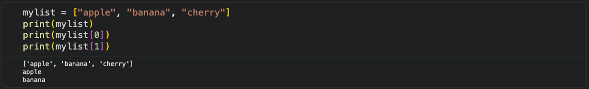

---

### 07. ข้อมูลคะแนนเพื่อน (Friends Scores)

สร้าง List ของรายชื่อเพื่อน 15 คน พร้อมคะแนน และแสดงผล

#### ตัวอย่างโค้ด:

```python
# สร้าง List ของรายชื่อเพื่อน 15 คน (ภาษาอังกฤษ)
friends = ["Alice", "Bob", "Charlie", "David", "Emma", 
           "Frank", "Grace", "Henry", "Ivy", "Jack",
           "Kate", "Leo", "Mary", "Nick", "Olivia"]

# สร้าง List สำหรับเก็บค่าคะแนน 15 ค่า
scores = [85, 92, 78, 95, 88, 76, 90, 82, 87, 91, 
          79, 84, 93, 80, 86]

# แสดงข้อความชื่อเพื่อนและคะแนนที่ได้ เรียงตามลำดับใน list
for i in range(len(friends)):
    print(f"เพื่อนคนที่ {i+1} ชื่อ {friends[i]} ได้คะแนน {scores[i]}")
```

#### ผลลัพธ์:


---

### 08. วิเคราะห์คะแนนเพื่อน (Friends Score Analysis)

วิเคราะห์ข้อมูลคะแนนเพื่อน หาค่าสูงสุด ต่ำสุด และเฉลี่ย

#### ตัวอย่างโค้ด:

```python
# หาคะแนนสูงสุด
max_score = max(scores)
max_index = scores.index(max_score)
print(f"คนที่ได้คะแนนมากที่สุดคือ {friends[max_index]} ได้คะแนน {max_score}")

# หาคะแนนต่ำสุด
min_score = min(scores)
min_index = scores.index(min_score)
print(f"คนที่ได้คะแนนน้อยที่สุดคือ {friends[min_index]} ได้คะแนน {min_score}")

# หาคะแนนเฉลี่ย
average_score = sum(scores) / len(scores)
print(f"คะแนนเฉลี่ยของทุกคนคือ {average_score:.2f}")
```

#### ผลลัพธ์:

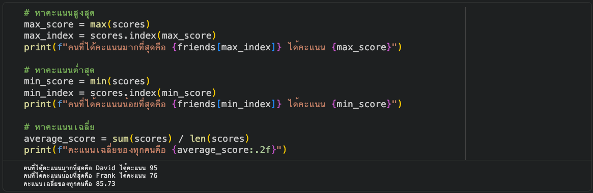

---

### 09. กราฟแท่งพื้นฐาน (Basic Bar Chart)

สร้างกราฟแท่งแสดงคะแนนของเพื่อนด้วย Matplotlib

#### ตัวอย่างโค้ด:

```python
import matplotlib.pyplot as plt

friends = ["Alice", "Bob", "Charlie", "David", "Emma", 
           "Frank", "Grace", "Henry", "Ivy", "Jack",
           "Kate", "Leo", "Mary", "Nick", "Olivia"]
scores = [85, 92, 78, 95, 88, 76, 90, 82, 87, 91, 
          79, 84, 93, 80, 86]

plt.figure(figsize=(12, 6))
plt.bar(friends, scores, color='skyblue')
plt.xlabel('Friends')
plt.ylabel('Scores')
plt.title('Friend Scores Bar Chart')
plt.xticks(rotation=45, ha='right')
plt.tight_layout()
plt.show()
```

#### ผลลัพธ์:

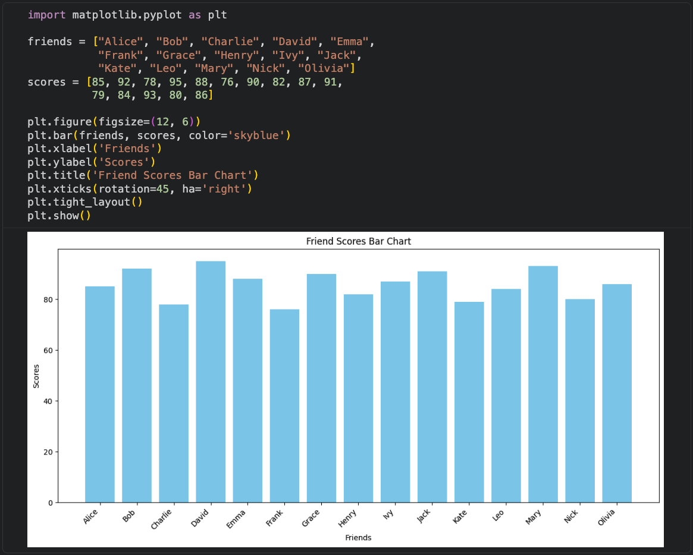

---

### 10. กราฟแท่งแบบปรับปรุง (Enhanced Bar Chart)

กราฟแท่งที่มีการใช้สีแยกตามคะแนน (สีเขียว = คะแนนสูง, สีส้ม = คะแนนต่ำ)

#### ตัวอย่างโค้ด:

```python
import matplotlib.pyplot as plt
import numpy as np

friends = ["Alice", "Bob", "Charlie", "David", "Emma", 
           "Frank", "Grace", "Henry", "Ivy", "Jack",
           "Kate", "Leo", "Mary", "Nick", "Olivia"]
scores = [85, 92, 78, 95, 88, 76, 90, 82, 87, 91, 
          79, 84, 59, 80, 86]

plt.figure(figsize=(10, 6))
colors = ['skyblue'] * len(scores) # เริ่มต้นด้วยสีฟ้าอ่อนทั้งหมด
for i, score in enumerate(scores):
    if score < 60:
        colors[i] = 'orange'
    elif score > 80:
        colors[i] = 'lightgreen' # ใช้ lightgreen เพื่อให้แตกต่างจากสีส้มและฟ้าอ่อน
plt.bar(friends, scores, color=colors)
plt.xlabel("Friend Name")
plt.ylabel("Score")
plt.title("Scores of Each Friend")
plt.xticks(rotation=45, ha='right')
plt.tight_layout()
plt.show()
```

#### ผลลัพธ์:

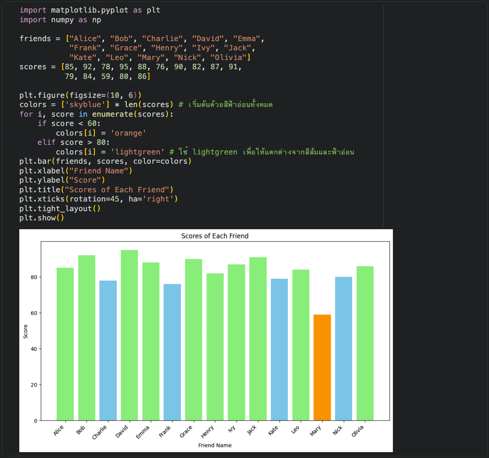

---

### 11. คำนวณพื้นที่สี่เหลี่ยมผืนผ้า (Rectangle Area)

รับค่าความกว้างและความยาวจากผู้ใช้ แล้วคำนวณพื้นที่

#### ตัวอย่างโค้ด:

```python
width = float(input("ป้อนความกว้าง: "))
length = float(input("ป้อนความยาว: "))

# คำนวณพื้นที่
area = width * length

# แสดงผลลัพธ์
print("พื้นที่สี่เหลี่ยมผืนผ้าคือ:", area)
```

#### ผลลัพธ์:


---

### 12. คำนวณพื้นที่สามเหลี่ยม (Triangle Area)

รับค่าฐานและความสูงจากผู้ใช้ แล้วคำนวณพื้นที่สามเหลี่ยม

#### ตัวอย่างโค้ด:

```python
import math

# รับค่าฐานและความสูงจากผู้ใช้
base = float(input("ป้อนความยาวฐานของสามเหลี่ยม: "))
height = float(input("ป้อนความสูงของสามเหลี่ยม: "))

# คำนวณพื้นที่สามเหลี่ยม
area = 0.5 * base * height

# แสดงผลลัพธ์
print("พื้นที่สามเหลี่ยมคือ:", area)
```

#### ผลลัพธ์:

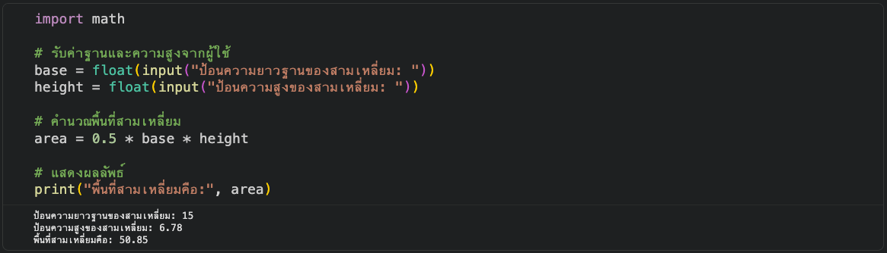

---

### 13. คำนวณพื้นที่วงกลม (Circle Area)

รับค่ารัศมีจากผู้ใช้ แล้วคำนวณพื้นที่วงกลม

#### ตัวอย่างโค้ด:

```python
import math

radius = float(input("ป้อนความยาวรัศมีของวงกลม: "))

# คำนวณพื้นที่ (pi * r^2)
area = math.pi * (radius ** 2)

print("พื้นที่วงกลมคือ:", area)
```

#### ผลลัพธ์:

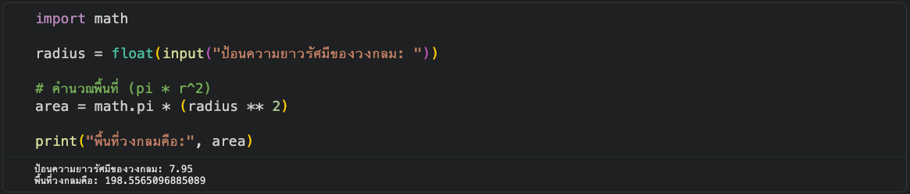

---

### 14. กราฟวงกลม (Circle Graph)

คำนวณพื้นที่วงกลมและแสดงกราฟวงกลมด้วย Matplotlib

#### ตัวอย่างโค้ด:

```python
import math
import matplotlib.pyplot as plt

# รับค่ารัศมีจากผู้ใช้
radius = float(input("ป้อนความยาวรัศมีของวงกลม: "))

# คำนวณพื้นที่ (pi * r^2)
area = math.pi * (radius ** 2)

# แสดงผลลัพธ์
print(f"พื้นที่วงกลมคือ: {area:.2f}")

# สร้างกราฟวงกลม
fig, ax = plt.subplots(figsize=(6, 6))
circle = plt.Circle((0, 0), radius, color='blue', alpha=0.5)
ax.add_artist(circle)

# ตั้งค่าแกน
ax.set_xlim([-radius * 1.2, radius * 1.2])
ax.set_ylim([-radius * 1.2, radius * 1.2])
ax.set_aspect('equal', adjustable='box')

# ใช้ฟอนต์ที่รองรับภาษาไทยหรือเปลี่ยนเป็นภาษาอังกฤษเพื่อหลีกเลี่ยง warning
plt.rcParams['font.family'] = ['DejaVu Sans', 'sans-serif']
plt.title(f'Circle with radius = {radius} and area = {area:.2f}')
plt.xlabel('X-axis')
plt.ylabel('Y-axis')
plt.grid(True)
plt.show()
```

#### ผลลัพธ์:


---

### 15. กราฟเชิงเส้น (Linear Graph)

สร้างกราฟเชิงเส้นจากสมการ y = 10x

#### ตัวอย่างโค้ด:

```python
import matplotlib.pyplot as plt
import numpy as np

# Define a range of x values
x = [1, 2, 3]

# Calculate y values using the equation y = 10x
y = [10 * val for val in x]

# Create the plot
plt.figure(figsize=(8, 6))
plt.plot(x, y, label='y = 10x', color='blue', marker='o')

# Add labels and title
plt.title('Graph of y = 10x')
plt.xlabel('x-axis (Number of notebooks)')
plt.ylabel('y-axis (Price)')
plt.grid(True)
plt.axhline(0, color='black', linewidth=0.5)  # Add x-axis line
plt.axvline(0, color='black', linewidth=0.5)  # Add y-axis line
plt.legend()
plt.show()
```

#### ผลลัพธ์:

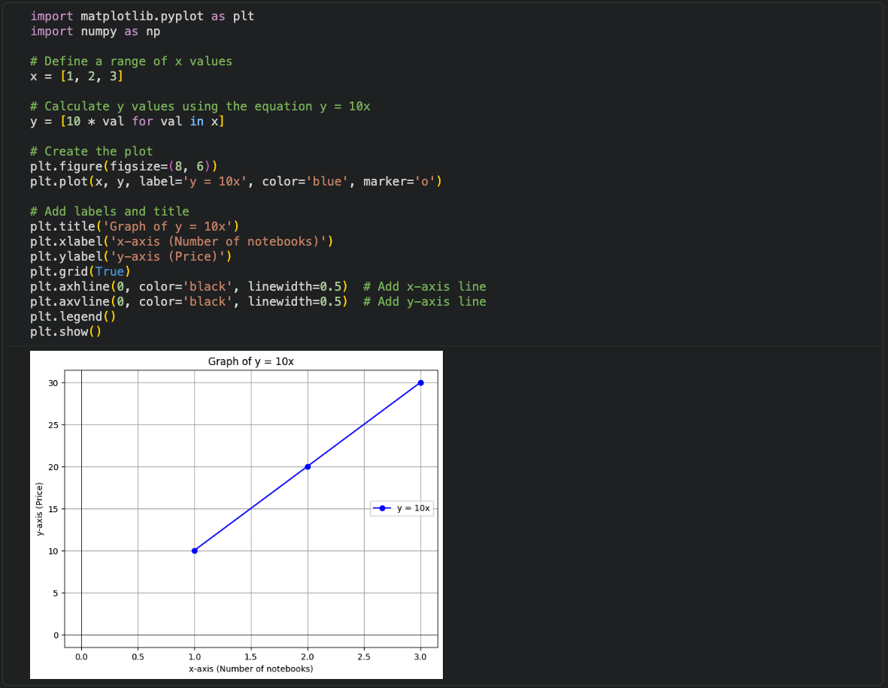

---

### 16. วาดสี่เหลี่ยมด้วย Turtle (Turtle Square)

ใช้ ColabTurtle วาดสี่เหลี่ยม

#### ตัวอย่างโค้ด:

```python
from ColabTurtle.Turtle import *

initializeTurtle()
color("red")
forward(100)
right(90)
forward(100)
right(90)
forward(100)
right(90)
forward(100)
right(90)
```

#### ผลลัพธ์:

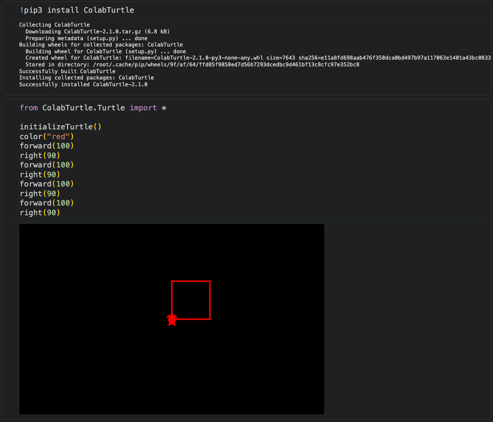

---

### 17. วาดดาวด้วย Turtle (Turtle Star)

ใช้ ColabTurtle วาดรูปดาว 5 แฉก

#### ตัวอย่างโค้ด:

```python
initializeTurtle()
color("blue")      # กำหนดสีเต่าเป็นสีน้ำเงิน
pensize(10)        # กำหนดความหนาของเส้น
speed(5)           # กำหนดความเร็วในการวาด

for _ in range(5):
    forward(150)
    right(144)
```

#### ผลลัพธ์:

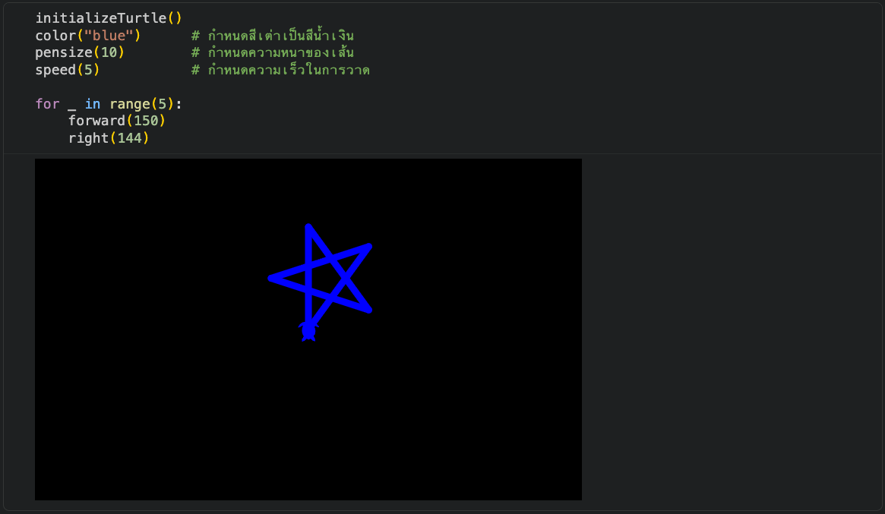

---

### 18. วาดเกลียวด้วย Turtle (Turtle Spiral)

ใช้ ColabTurtle วาดรูปเกลียวสีสันสดใส

#### ตัวอย่างโค้ด:

```python
initializeTurtle()
speed(10)
colors = ["red", "orange", "yellow", "green", "blue", "purple"]

for i in range(250):
    pencolor(colors[i % 6])
    forward(i * 2)
    left(59)
```

#### ผลลัพธ์:

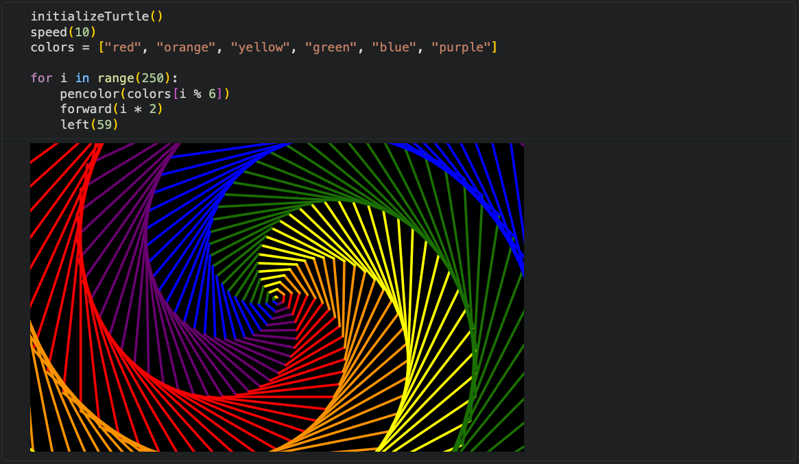

---

### 19. วาดรูปทรงหลากหลายด้วย Turtle (Turtle Shapes)

ใช้ ColabTurtle วาดรูปทรงเกลียวสวยงามด้วย 4 สี

#### ตัวอย่างโค้ด:

```python
initializeTurtle()
speed(10)
pensize(8)
colors = ["red", "orange", "yellow", "green"]

for i in range(250):
    pencolor(colors[i % 4])  # สลับสีไปเรื่อยๆ ทีละสี 4 สี
    forward(i * 2)
    left(121)
```

#### ผลลัพธ์:

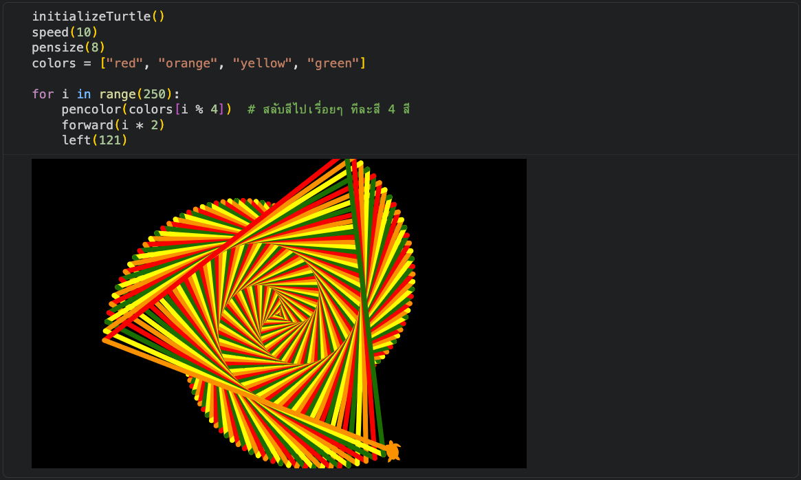

---


## 📝 การคอมเมนต์ (Comments)

การคอมเมนต์ใน Python ใช้เครื่องหมาย `#` นำหน้าข้อความที่ต้องการคอมเมนต์

#### ตัวอย่างการใช้งาน:

```python
# นี่คือคอมเมนต์บรรทัดเดียว
print("Hello")  # คอมเมนต์หลังคำสั่ง
# คอมเมนต์อธิบายโค้ด
```

---

## 📄 License

This project is for educational purposes.

---

<div align="center">

**Made with ❤️ for Python Learners**

</div>
